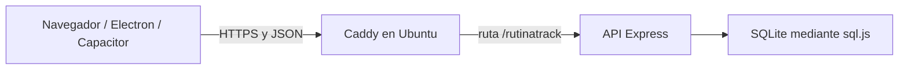

# Guía de defensa — sistema de gestión de entrenamientos

## Presentación oral de dos minutos

Este proyecto aborda la organización y el seguimiento de los entrenamientos de gimnasio. Busca reunir las rutinas, las series realizadas y el progreso en una sola aplicación, con responsabilidades distintas para atletas, entrenadores y administradores.

El atleta consulta sus rutinas, inicia una sesión y registra peso y repeticiones de cada serie. El entrenador crea rutinas, las asigna a sus propios atletas y consulta su actividad. El administrador gestiona usuarios y accede a reportes globales. El sistema permite comparar sesiones mediante gráficos y exportar reportes en CSV.

La solución tiene una arquitectura cliente-servidor. React implementa la interfaz; Node.js y Express exponen una API REST; SQLite, mediante sql.js, almacena la información. Las contraseñas se guardan como hashes bcrypt y la autenticación utiliza JWT. Los permisos se comprueban en el backend: ocultar un botón no alcanza para proteger los datos.

La aplicación web fue desplegada en una máquina virtual Ubuntu con Caddy como proxy HTTPS. Esto permite que distintos equipos usen un mismo servidor por Internet. El mismo frontend se reutiliza en Windows con Electron y en los proyectos móviles con Capacitor. El instalador Windows está generado; los proyectos Android e iOS están preparados, pero no deben presentarse como aplicaciones nativas finales verificadas en dispositivos.

El resultado es un prototipo funcional para una tesis y una instalación pequeña. Sus próximos pasos son completar las pruebas móviles, mejorar la operación del servidor y migrar la persistencia si aumenta la escala.

## Qué hace cada rol

| Rol | Responsabilidad | Restricción principal |
|---|---|---|
| Atleta | Ejecutar rutinas, registrar series, consultar progreso y peso corporal | Accede a sus propias sesiones y a las rutinas que le corresponden |
| Entrenador | Crear y asignar rutinas, consultar actividad y exportar reportes | Solo gestiona a los atletas vinculados a él |
| Administrador | Crear usuarios, activar/desactivar, reasignar entrenadores y consultar reportes globales | Sus privilegios no se obtienen mediante registro público |

El registro público solo crea atletas. Los roles entrenador y administrador requieren una acción de un administrador autenticado.

## Arquitectura y decisiones

- **React + Vite:** componentes reutilizables y compilación del frontend. CSS propio con variables, pensado para una interfaz legible en el gimnasio.
- **Express:** API organizada por recursos y validación centralizada de permisos y reglas de negocio.
- **SQLite/sql.js:** facilita la instalación al evitar un servidor SQL separado y dependencias nativas de SQLite. sql.js trabaja en memoria y persiste el archivo; requiere una sola instancia de API por base. No equivale a una infraestructura distribuida.
- **JWT:** acredita la sesión. El backend también consulta al usuario actual para comprobar su estado y permisos.
- **bcryptjs:** calcula hashes bcrypt; la contraseña original no se guarda en la base.
- **Electron y Capacitor:** reutilizan el frontend. Electron puede incluir Express y una base local; las apps móviles se conectan al servidor remoto. Las bases locales no se sincronizan automáticamente con el servidor central.
- **Caddy + systemd:** HTTPS y enrutamiento; servicio que arranca con Ubuntu. Publicar el código en GitHub no mantiene encendido ese servidor.

## Modelo de datos

| Tabla | Qué representa |
|---|---|
| users | Identidad, rol, estado y relación atleta-entrenador |
| exercises | Catálogo e instrucciones de ejecución |
| routines | Plan creado y atleta asignado |
| routine_exercises | Ejercicios, orden y objetivos de una rutina |
| workout_sessions | Entrenamiento iniciado o completado |
| session_sets | Trabajo efectivamente realizado: peso, repeticiones y RPE opcional |
| body_weight_logs | Evolución del peso corporal |

La distinción clave es **planificado frente a realizado**: una rutina contiene objetivos; una sesión registra lo que ocurrió. Esto permite contrastar el entrenamiento real con el plan sin confundir ambos datos.

## Reglas que conviene demostrar

1. Intentar registrar más de 20 repeticiones: la API lo rechaza con un error 400, aunque se evite la interfaz.
2. Un entrenador no puede consultar atletas ajenos modificando un identificador.
3. Una sesión asociada a una rutina solo puede iniciarla el atleta asignado.
4. El QR usa un token aleatorio, no un ID consecutivo. Quien tenga el enlace puede ver el nombre y las rutinas activas: es una vista pública limitada, no una autorización para editar.
5. Una instalación nueva genera un administrador con contraseña aleatoria. Las cuentas conocidas del seed son únicamente para demostración local.

El tope de 20 es una regla del proyecto; no debe defenderse como garantía médica de que un entrenamiento sea seguro. Las instrucciones de ejercicios son texto original y no se incorporaron imágenes de terceros.

## Cómo se calcula el progreso

- **Volumen semanal:** suma de peso × repeticiones de las series de sesiones completadas. Ejemplo: 3 series de 10 repeticiones con 20 kg suman 600 kg·repeticiones.
- **Peso máximo por ejercicio:** mayor carga registrada por día. No es una estimación de una repetición máxima (1RM).
- **Peso corporal:** registros históricos introducidos por el atleta.
- **Actividad:** sesiones completadas dentro del período consultado; el resumen de entrenadores considera los últimos 30 días.

Son indicadores descriptivos. El volumen por sí solo no demuestra mejoras fisiológicas ni permite comparar de manera equivalente todos los ejercicios o máquinas.

## Guion de demostración de cinco minutos

1. Mostrar los tres roles y entrar como atleta en una base de demostración.
2. Abrir una rutina y señalar objetivos e instrucciones.
3. Iniciar sesión, registrar dos series y completar el entrenamiento.
4. Mostrar la sesión en el historial y su efecto en el progreso.
5. Entrar como entrenador y explicar el acceso limitado a sus atletas.
6. Mostrar reportes de administrador, exportación CSV y vista pública del QR.

Usar datos ficticios. Preparar la demo antes de la exposición y comprobar la conexión. El seed contiene 44 ejercicios, cuatro usuarios y nueve semanas de sesiones de ejemplo; esos datos son sintéticos, no resultados de un estudio con atletas.

## Preguntas habituales y respuestas

**¿Por qué no una planilla?** La aplicación agrega relaciones entre roles, validación centralizada, registro por sesión y consulta compartida desde diferentes dispositivos. No se afirma que sustituya toda herramienta de un gimnasio.

**¿Cómo impedís que un entrenador vea datos ajenos?** La API comprueba la relación trainer_id además del rol, en cada operación pertinente. La interfaz no es la barrera de seguridad.

**¿Puede funcionar desde otra red?** Sí, los clientes apuntan a una URL pública HTTPS. El dominio dirige al proxy y este a Express. La PC anfitriona, la VM y la conexión deben estar disponibles.

**¿Funciona sin Internet?** La instalación de escritorio puede usar su servidor local. El modo conectado al servidor central necesita red; no hay sincronización offline implementada.

**¿Qué pasa si crece el número de usuarios?** Se deben medir carga y concurrencia. La implementación actual usa una sola API y una base sql.js; para varias instancias convendría migrar a PostgreSQL y diseñar respaldos, observabilidad y pruebas de carga.

**¿Qué significa que sea multiplataforma?** El frontend se reutiliza en navegador, Electron y Capacitor. Tener proyectos nativos generados no prueba que estén listos para publicar en las tiendas.

**¿Qué pruebas se hicieron?** Se verificaron permisos, restricciones SQL, autenticación, sesiones, reportes, seed, clientes concurrentes y CORS; también el frontend compilado y el runtime de Electron. Hay nueve pruebas backend y dos de identificación de servidor. El despliegue fue comprobado por HTTPS, login y reinicio del servicio. Las pruebas nativas finales siguen pendientes.

**¿Se usó IA?** Se utilizó asistencia de IA para desarrollo y documentación. Para la defensa corresponde explicar el código y sus decisiones, distinguir lo verificado de lo pendiente y declarar esa asistencia según las normas de la universidad.

## Alcance real y pendientes

Implementados: flujo web de entrenamiento, permisos por rol, reportes, QR, servidor HTTPS y generación de instalador Windows. Android e iOS cuentan con proyectos Capacitor sincronizados; no se generó un APK o IPA final en este entorno. No se verificó un instalador macOS.

Pendientes: pruebas en dispositivos móviles reales, descarga CSV en WebViews, ejercicios medidos por tiempo (las planchas se excluyen del registro por repeticiones), pruebas de carga, automatización de respaldos y mayor disponibilidad del servidor. No presentar pruebas funcionales como una auditoría integral de seguridad ni afirmar validación clínica o un estudio de usabilidad que no se realizó.
